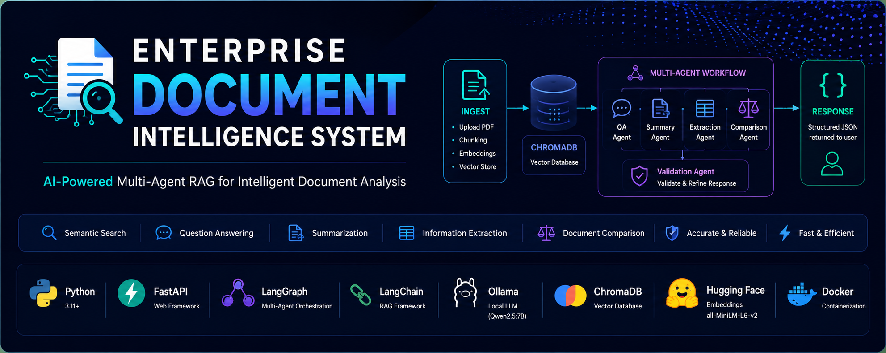
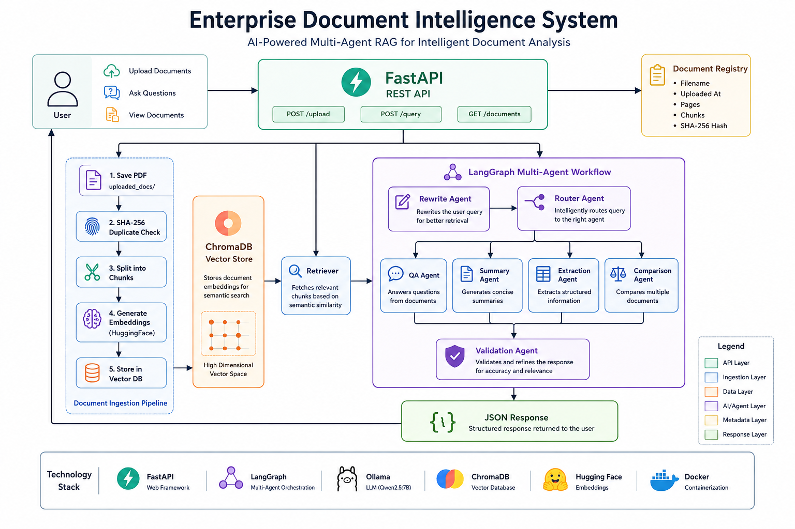
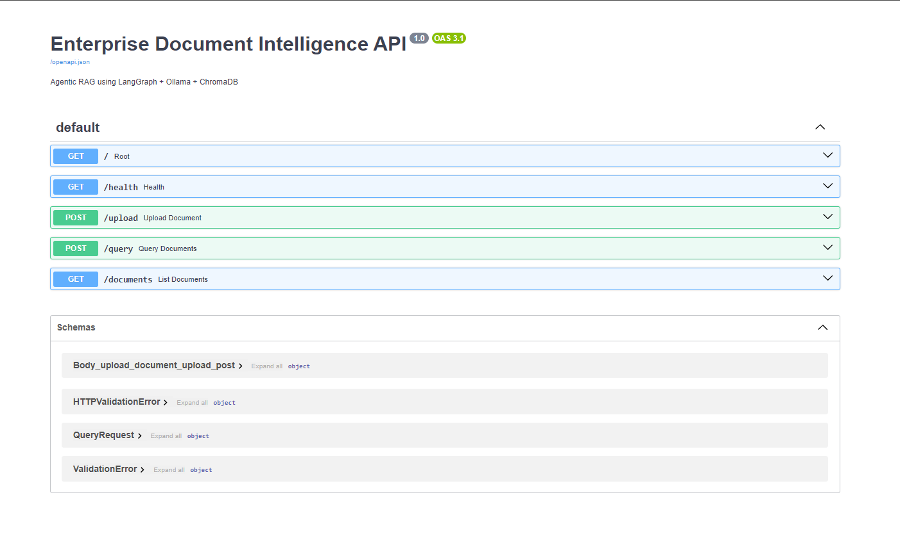
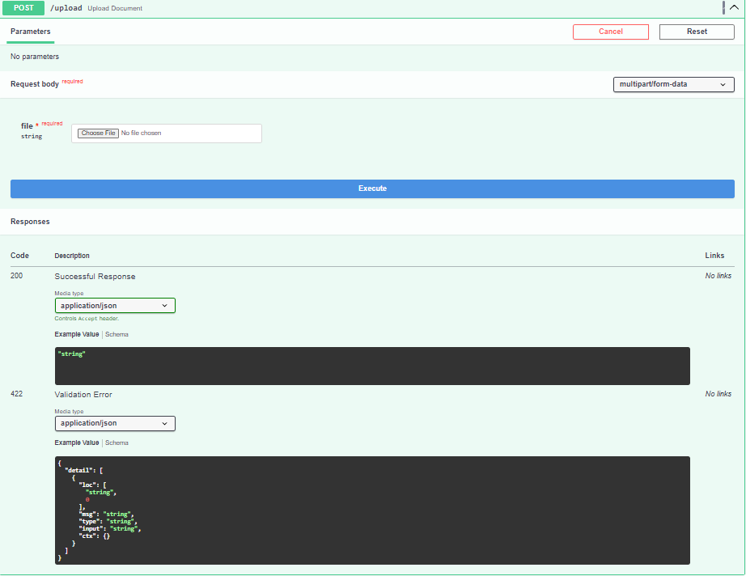
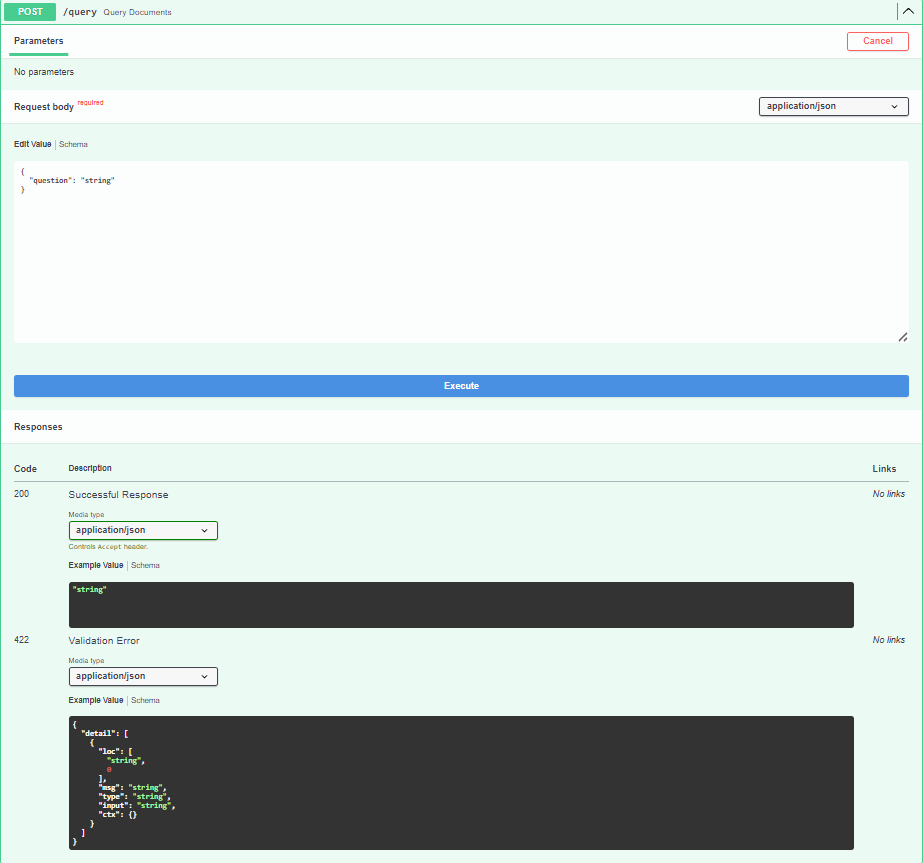

<p align="center">
  
</p>

<h1 align="center">Enterprise Document Intelligence System</h1>

<p align="center">
An enterprise-style Multi-Agent Retrieval-Augmented Generation (RAG) platform for intelligent PDF analysis using FastAPI, LangGraph, Ollama, and ChromaDB.
</p>

<p align="center">


</p>

---

## 🏗️ System Architecture

<p align="center">
  
</p>

---

## Features

- 📄 Upload PDF documents
- 🔍 Semantic Search using ChromaDB
- 🤖 Multi-Agent Workflow using LangGraph
- ✍️ Query Rewriting
- 🧭 Intelligent Agent Routing
- ❓ Question Answering
- 📝 Document Summarization
- 📊 Information Extraction
- ⚖️ Document Comparison
- ✅ Response Validation
- 🚀 FastAPI REST API
- 🐳 Docker Support
- 💻 Local LLM using Ollama

---

## Tech Stack

| Category | Technology |
|-----------|------------|
| Backend | FastAPI |
| AI Framework | LangChain |
| Workflow | LangGraph |
| LLM | Ollama (Qwen2.5:7B) |
| Vector Database | ChromaDB |
| Embeddings | HuggingFace all-MiniLM-L6-v2 |
| Language | Python |
| Containerization | Docker |

---

## Project Structure

```text
Enterprise-Document-Intelligence/
│
├── api.py
├── requirements.txt
├── Dockerfile
├── README.md
├── document_registry.json
│
├── src/
│   ├── agents.py
│   ├── graph.py
│   └── router.py
│
├── uploaded_docs/
├── vectorstore/
├── architecture/
├── screenshots/
└── docs/
```

---

## Workflow

```text
Upload PDF
      │
      ▼
Chunk Documents
      │
      ▼
Generate Embeddings
      │
      ▼
Store in ChromaDB
      │
      ▼
Retriever
      │
      ▼
Rewrite Agent
      │
      ▼
Router Agent
      │
      ▼
QA / Summary / Extraction / Comparison
      │
      ▼
Validation Agent
      │
      ▼
JSON Response
```

---

## API Endpoints

| Method | Endpoint | Description |
|--------|----------|-------------|
| POST | /upload | Upload and index PDF |
| POST | /query | Ask questions |
| GET | /documents | List uploaded documents |

---

## Installation

Clone repository

```bash
git clone <repository-url>
```

Install dependencies

```bash
pip install -r requirements.txt
```

Run Ollama

```bash
ollama run qwen2.5:7b
```

Run API

```bash
python -m uvicorn api:app --reload
```

Open Swagger

```
http://127.0.0.1:8000/docs
```

---

## Screenshots

### Swagger UI

<p align="center">
  
</p>

### Upload Endpoint

<p align="center">
  
</p>

### Query Endpoint

<p align="center">
  
</p>
---

## Future Improvements

- OCR Support
- Authentication
- Hybrid Search
- Cloud Deployment
- Role-Based Access
- Multi-user Support

---

## Author

**Veer Jariwala**

Electronics and Communication Engineering

National Institute of Technology Tiruchirappalli